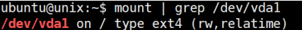

# 03. Directory and File

## Directory

### Root Directory

- 리눅스의 디렉토리는 루트(”/”) 부터 시작하여 트리 형태의 계층 구조를 이룸
- **Windows의 경우**
    - 각각의 저장 장치 파티션마다 드라이브 문자(C, D 드라이브) 지정
    - 각 드라이브마다 루트가 존재하고 디렉토리 구조가 존재
- **Linux 의 경우**
    - 모든 정보는 Root부터 시작하여 단일한 트리 구조로 구성됨
    - Root를 관리하는 파일 시스템을 루트 파일 시스템이라고 함
        
        
        
        - Ext4 라는 파일 시스템이 루트를 관리하고 있다는 의미
        - /dev/vda1 이라는 저장 장치에 루트 파일 시스템 내부의 정보가 저장됨
    - 루트 파일 시스템 하의 어떤 디렉토리에 해당 장치를 마운트시킬 수 있음
        - 새로운 디렉토리 `/home/user/new_ssd` 라는 디렉토리를 만들고 새 장치 Mount를 수행하면 해당 디렉토리 밑에 저장되는 정보는 루트 파일 시스템이 아닌 새로운 장치에 저장됨

### Home Directory

- 각 사용자마다 별도의 홈 드렉토리를 가짐

### 기타 Directory

- /bin
    - Binaries
    - System-wide(global)하게 사용되는 기본적인 명령어에 대한 실행 파일
- /sbin
    - System Binaries
    - 시스템 관리를 위한 명령어의 실행 파일
- /lib
    - Libraries
    - System-wide 하게 사용되는 라이브러리 파일
- /usr
    - 각 사용자들이 설치한 프로그램들의 실행파일과 라이브러리, 소스, 매뉴얼 등
    - /usr/local: 새로운 프로그램들이 설치됨(Windows의 c:\program files\ 와 유사)
- /etc
    - Configurations
    - 네트워크, 서비스, 사용자, 암호 등의 각종 환경 설정 파일
- /var
    - Variable data
    - 시스템 동작 중에 계속해서 변화하는 파일들 저장(로그, 웹 데이터, lock)

### 경로명

- 절대경로명: 루트 디렉토리부터 시작하여 경로 이름을 정확하게 적는 것
- 상대경로명: 현재 작업 디렉토리부터 시작하여 경로 이름을 적는 것
- 참고
    - `~` : 홈 디렉토리
    - `.` : 현재 디렉토리
    - `..` : 부모 디렉토리

## File

- 정보를 영속적으로 저장하기 위해서는 파일에 저장해야 함
- 유닉스 파일: 모든 데이터를 연속된 바이트 형태로 저장

### Link

[https://m.blog.naver.com/kwonkise/222038118502](https://m.blog.naver.com/kwonkise/222038118502)

- **하드 링크**
    - 기존 파일에 대한 또 하나의 새로운 이름 등록
    - 원본 파일의 i-number가 복사되어 동일한 i-node를 사용함
    - 원본 파일의 용략과 하드링크 파일의 용량이 같게 표시됨
    - 원본 파일을 수정하면 하드 링크 파일도 수정되고, 하드 링크 파일을 수정하면 원본 파일도 수정됨
    - 원본 파일을 삭제하는 경우, **하드 링크는 i-node를 통하여 원본 파일이 저장된 주소로 데이터를 찾아내어 원본 파일이 지워지지 않고 유지**됨
    - 하드 링크는 원본 데이터의 위치 정보를 가진 파일로 생성되므로 파일을 완전히 지우고 싶다면 생성한 모든 하드 링크까지 포함하여 삭제해야 함.
- **심볼릭 링크**
    - 다른 파일을 가리키고 있는 별도의 파일
        - i-node 번호가 원본 파일과 다른 것을 확인할 수 있음
    - 실제 파일의 경로명을 저장하고 있는 일종의 특수 파일
    - 이 경로명이 다른 파일에 대한 간접적인 포인터 역할 수행
    - Windows의 바로가기와 기능이 유사함
    - 원본 파일의 정보가 포함되어 있지 않고, 원본 파일의 위치 정보(포인터)만 포함
    - 심볼릭 링크 파일의 용량은 바로가기와 같이 원본파일 용량과 다르게 나타남
    - 원본 파일을 수정하면 심볼릭 링크 파일도 수정되고, 심볼릭 링크 파일을 수정하면 원본 파일도 수정됨
    - **원본파일 삭제시 심볼릭 링크 파일은 원본 파일이 없다는 에러**를 나타냄

> **i-node**
유닉스 계통 파일 시스템에서 사용하는 자료구조
소유자 그룹, 접근 모드, 파일 형태, 아이노드 넘버(i-number) 등 해당 파일에 관한 정보를 가지고 있음
파일들은 각자 1개의 아이노드를 가짐. 파일시스템 내의 파일들은 고유한 아이노드 숫자를 통해 식별 가능
> 

### 명령어

- pwd: 현재 작업중인 디렉토리 명
- cd: 해당 디렉토리로 이동
- which: 명령어의 절대경로를 출력(실행파일의 경로)
- ls: 지정된 디렉토리의 내용을 리스트
디렉토리를 지정하지 않으면 현재 디렉토리 내용 리스트
파일을 지정하면 해당 파일만을 리스트
- mkdir: 디렉토리 생성
- rmdir: 디렉토리 삭제
- file: 파일의 종류 확인
- stat: 파일의 자세한 상태 정보 출력
- cat: 파일들의 내용을 그대로 화면에 출력. **파일을 지정하지 않으면 표준입력 내용을 그대로 화면에 출력**
- more: 파일들의 내용을 페이지 단위로 화면에 출력
- head: 파일들의 앞부분을 화면에 출력. 파일을 지정하지 않으면 표준입력 내용을 대상으로 함
- tail: 파일들의 뒷부분을 화면에 출력. 파일을 지정하지 않으면 표준입력 내용을 대상으로 함
- wc: 파일에 저장된 줄(l), 단어(w), 문자(c)의 개수를 세서 출력
- cp: 파일1을 파일2에 복사 or 파일(들)을 지정된 디렉토리에 (모두) 복사
    - -i (대화형 옵션) 지정 시 이름이 같은 파일이 이미 존재하는 경우, 덮어쓸 것인지 다시 물어봄
- mv: 파일1의 이름을 파일2로 변경 or 파일(들)을 지정된 디렉토리로 (모두) 이동
- rm: 파일(들)을 (모두) 삭제
    - -r 옵션을 통해 디렉토리 아래의 모든 것을 삭제
- ln [-s] 파일1 파일2
    - 파일1에 대한 새로운 이름(링크)로 파일2를 만들어줌
    - -s 옵션 지정시 심볼릭 링크 생성