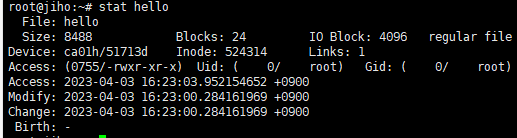

# 04. Privilege and Permission

## Privilege

### 슈퍼유저

- 슈퍼유저(superuser)
    - 시스템을 관리할 수 있는 사용자
    - “root”: 슈퍼유저가 사용하는 계정
    - root 로그인 시 Shell의 모양이 $가 아닌 #으로 표시됨
- 슈퍼유저 로그인 방법
    - 직접 root 계정으로 로그인
    - 다른 계정으로 로그인 후 su 명령 사용, root 패스워드 입력
    - sudo -s 명령 사용, 본인 패스워드 입력

### 사용자와 그룹

- 여러 사용자를 하나의 그룹으로 묶어 관리할 수 있음
- 권한 공유를 위해 주로 사용
- 한 사용자는 최소 하나의 그룹에 속해야 함
    - 이를 primary group이라고 함
    - 새로운 사용자를 만들 경우, 해당 사용자 이름과 동일한 이름으로 새로운 그룹이 생성되고, 자동으로 해당 사용자가 해당 그룹에 속하게 되며, primary group으로 지정됨
- 한 사용자는 여러 그룹에 속할 수 있음
- 사용자와 그룹은 unique id and number로 관리

## Permission

- **접근권한**
    - 각 파일에는 소유 사용자, 소유 그룹, 그에 따른 접근 권한이 존재
    - Stat 명령어 사용 시 Access(접근 권한), Uid(소유 사용자 정보), Gid(소유 그룹 정보) 확인 가능
        
        
        
    - 파일에 대한 읽기(r), 쓰기(w), 실행(x) 권한
        - 소유자(owner)/그룹(group)/기타(others)로 구분하여 관리
        - 8진수로 접근권한을 표현함
        
        
        

## 명령어

- useradd: 사용자 계정 생성
- adduser: 새로운 사용자 정보 입력이 보다 편리하고, 사용자 환경을 설정
- passwd: 사용자 패스워드 설정
- userdel: 사용자 계정 삭제
- groupadd: 그룹 생성
- groupdel: 그룹 삭제
- groups: 사용자의 소속 그룹 확인. 사용자명을 지정하지 않을 경우 현재 로그인한 사용자 정보 출력
- usermod -G 그룹명 사용자명
    - 사용자에 새로운 소속 그룹 지정
    - 그룹명에 comma를 사용해 여러 그룹을 지정할 수 있고, 공백 문자는 사용하면 안됨
    - 현재 소속된 그룹명이 포함되어 있지 않다면, **해당 그룹에서는 제거됨**
        - -a 옵션을 -G 옵션과 함께 사용하면 새로운 그룹을 append 하기만 함
- chown: 파일 혹인 디렉토리의 소유자를 지정한 사용자로 변경
- chgrp: 파일 혹은 디렉토리의 소유 그룹을 지정된 그룹으로 변경
- chmod: 파일 혹은 디렉토리의 접근 권한 변경
    - 8진수로 접근권한 변경: `chmod 644 cs1.txt`
    - 기호를 이용한 접근권한 변경: `chmod g-w,o+rw cs1.txt`
        
        